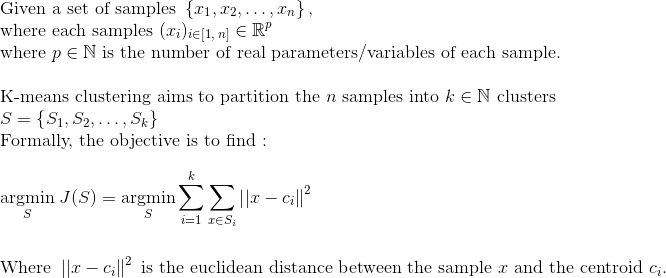

## K-Means principle

Partitioning into k-means is a data partitioning method and a combinatorial optimization problem. Given points and an integer k, the problem is to divide the points into k groups, often called clusters, in order to minimize a certain function. We consider the distance from a point to the average of the points of its cluster; the function to minimize is the sum of the squares of these distances. It is a classical heuristic used for a lot of applications. The k-means method is an approximation algorithm.

The k-means are used in particular in unsupervised learning where observations are divided into k scores. 


## K-Means application

To introduce the k-means example. I will illustrate it through an approximation of colors in an image. This way, for a given integer k,  we can create k mean color who are the k best colors to approximate the image. On the image below, they were 30173 different colors.


For a given k, the k-means algorithm tends to find the k bests centroids. The centroids are the centers of the k clusters from points in the dataset. It seeks to minimize the cost function. The cost is here the sum the each euclidean distances for each point to its associated centroid.  



## Pseudo Code

```
For a given integer k and a data set of samples

Choose k centroids arbitrarily or randomly

While the convergence is not reached

          Assign to each samples the nearest centroid
          
          Update each centroid as the mean of the samples, which are assigned to the centroid
```

## Let's start with python for the k-means algorithm


Firstly we need to import :
* numpy to deal with arrays or matrices
* scikit-learn to generate artificialy a data set 
* matplotib for the render

### Import

```python
import numpy as np  # to deal with array and matrix calculation easily

from sklearn.datasets.samples_generator import make_blobs  # generate data

import matplotlib.pyplot as plt  # to plot
import matplotlib.animation as animation  # to animate the plot
import matplotlib.patches as mpatches  # to add legends easily
```

### Variables

As usual I made a region to change the variables to an easier understanding. Variables that can be manually changed are those, which are in uppercases. They are classed as variables for : 
* K-means algotithm
* Elbow method
* Rendering 

```python
# K-means variables
X = None  # features matrix
N_SAMPLES = 500  # number of sample to create artificially
K = 5  # value of k for the k-means algorithm
centroids = None  # will be the centroids array
last_centroids = None  # will keep in memory the previous array of centroids


# elbow method variables
ELBOW_METHOD = False  # to choose to launch and see the elbow method for the current dataset
K_MAX = 20  # max value of k to test with the elbow method ( will test k from 1 to K_MAX)


# plot variables
INTERVAL = 500  # speed of the animation frame (ms)
fig = plt.figure(1, figsize=(8, 4.5))  # to plot
ax = fig.add_subplot(1, 1, 1)  # the axes
ani = None  # to animate the plot
started = False  # indicates if the program is started
first_frame = -1  # indicates the first frame number to know the current iteration value
# choose the color respectively to the centroids (add color to have more than K = 10)
colors = {0: '#FF00FF', 1: '#999999', 2: '#2F9599', 3: 'red', 4: 'blue',
          5: 'yellow', 6: 'pink', 7: 'orange', 8: 'brown', 9: 'purple'}
```

### Load dataset

To begin with the k-means algorithm we will simply generate randomly a data set. Generate an artificial data set is a key to deal with algorithms for a data scientist. Here the data set we generate is fully composed of samples in 2 dimensions with variable's value between 0 and 30. It is an arbitrary choice to generate values in [0, 30] but I choose to have a 2-dimensionnal-sample to plot easily the render.


```python
def load_dataset():
    """
    Make an artificial dataset with random centered values
    :return: the dataset with point of coordinates (x, y) in [0, 30]x[0, 30]
    """
    X, _ = make_blobs(n_samples=N_SAMPLES, centers=25, n_features=2, cluster_std=2)
    return X + 15  # + 15 to have positive values (not needed of course)
```

### K-means algorithm

To deal with the K-means algorithm, we need to create the `euclidean_distance()` to calculate the distance between the samples to a given centroid. The function takes two arguments : the X matrix of samples (and their coordinates) and the coordinates array of the given centroid. It returns the array of each distance between the sample and the centroid.

```python
def euclidean_distance(X, centroid):
    """
    Calculate the euclidean distance between the samples and a given centroid
    :param X: matrix of sample coordinates
    :param centroid: given centroid from which the distance is calculated
    :return: array of each distance between the samples a the centroid
    """
    # Calculation of the distance of each coordinate's dimension to the centroid coordinate value associated
    coord_difference_to_square = (X - np.full(X.shape[1], centroid, dtype=np.ndarray))**2
    # Return the euclidean distance value
    return coord_difference_to_square.sum(axis=1, keepdims=True)**0.5
```
The first step of the k-means method is to find the nearest centroids for each point. The `nearest_centroid()` fucntion seeks to do this step. It finds the nearest centroid for each samples and returns their respective index as an array. It takes two arguments : the X matrix of samples and the array of centroids (and their coordinates so it is a matrix in fact).
 
```python
def nearest_centroid(X, centroids):
    """
    Indicates the associated centroid (index of the centroid in the array) for each sample of X
    :param X: matrix of sample coordinates
    :param centroids: array of centroids
    :return: index array of the associated centroid for each sample
    """
    # Create an array
    # (used to be stacked with arrays of euclidean distances from each sample to each centroid)
    dist_to_centroids = np.full((X.shape[0], 1), float('inf'))
    # Calculate for each centroid the euclidean distance from each sample
    for i, centroid in enumerate(centroids):
        # Stack the distance arrays to form a matrix
        dist_to_centroids = np.hstack((dist_to_centroids, euclidean_distance(X, centroid)))
    # Return the index of the nearest centroid for each sample
    return np.argmin(dist_to_centroids, axis=1) - 1 # - 1 as the first index if the unused fulled-'inf' array
```

Then, we need to update each centroid as the mean of the samples, which are assigned to the centroid. The `adjust_centroid()` fucntion calculates the new coordinates of the centroids and returns them. It takes three arguments : the X matrix of samples, the array of the nearest centroid for each samples given by the `nearest_centroid()` function and the array of currrent centroids to update.

```python
def adjust_centroid(X, nearest_centroid_array, current_centroids):
    """
    Calculate the mean coordinates of the associated samples for each centroid
    :param X: matrix of sample coordinates
    :param nearest_centroid_array: array of index of the nearest centroid for each sample
    :param current_centroids: current centroid coordinates
    :return: the updated coordinates for each centroid as an array
    """
    # Calculation of the updated coordinate for each centroid
    for i, centroid in enumerate(np.unique(nearest_centroid_array)):  # for each centroid
        # pick up the indexes of nearest samples
        nearest_samples_index = np.where(nearest_centroid_array == centroid)
        # pick up their coordinates
        nearest_samples_coord = X[:][nearest_samples_index]
        # Calculate the mean coordinate for new coordinate of centroid
        new_coord = np.mean(nearest_samples_coord, axis=0)
        # change the centroid
        current_centroids[i] = new_coord
    return current_centroids
```

The `calculate_cost()` calculates the cost of the current iteration, which is the sum of each euclidean distance between each centroid an its associated sampels.

```python
def calculate_cost(X, current_centroids):
    """
    Calculation the cost with the current centroids
    :param X: matrix of sample coordinates
    :param current_centroids: current centroids
    :return: cost of the k_means step
    """
    # Work as the the nearest_centroid() method
    # but return the sum of min values of euclidean distances for each samples to the centroids
    # (not the array of indexes of nearest centroid for each sample )

    # Create an array
    # (used to be stacked with arrays of euclidean distances from each sample to each centroid)
    dist_to_centroids = np.full((X.shape[0], 1), float('inf'))
    for i, centroid in enumerate(current_centroids):
        # Stack the distance arrays to form a matrix
        dist_to_centroids = np.hstack((dist_to_centroids, euclidean_distance(X, centroid)))
    # Return the sum of min values of euclidean distances for each samples to the centroids
    return sum(np.amin(dist_to_centroids, axis=1))
```
At last we create the `k_means()` function, which will run the algorithm while the convergence is not reached.

This function is a little special as it will be called by the matplotlib.animation object. That's why there is the argument `frame_number` which is incremented each time the function is called. In this program, we will activate the k-means algorithm by pressing the Enter key. Only when the key is pressed, the `k_means()` will run the algorithm.

As you may have seen, the `display()` is not written yet. I addition to that, the function, which links the Enter key to the start is also not written. It will be the next step.

```python
def k_means(frame_number):
    """
    K-means algorithm (main function)
    :param frame_number: frame number of the matplotlib.animation
    """
    global centroids, first_frame, last_centroids
    # Wait for the program to start
    if started:
        # To know if it is the first time the k_means() function is called
        if first_frame == -1:  # keep the first frame value
            first_frame = frame_number  # indicates the first frame value
            centroids = np.random.rand(K, 2) * np.array([0, 30])  # create random centroids on the x2-axis
            last_centroids = centroids[:] / 2  # to make sure to have different values

        # If an update is necessary (or while not converging)
        if not np.array_equal(centroids, last_centroids):
            # display the current centroid and associated sampels
            display(frame_number - first_frame)
            # keep the current centroid before the adjustments to know if there is a convergence
            last_centroids = np.array(centroids)
            # pick up the nearest centroid indexes of each samples
            nearest = nearest_centroid(X, centroids)
            # adjust the current centroids
            centroids = adjust_centroid(X, nearest, centroids)
```
### Display

That is the time to add the `display()` function to render the algorithm. It only shows the samples values and waits for the Enter key too to display the logistic regression curve. It takes for argument the iteration number of the algorithm, which will be indicated in the legend of the plot.

```python
def display(iteration=0):
    """
    Display the k_means algorithm
    :param iteration: number of current iteration/step
    """
    global centroids

    # clear the plot
    ax.clear()

    # set the labels to describe the plot
    ax.set_xlabel("x1")  # first feature
    ax.set_ylabel("x2")  # second feature
    ax.set_xlim(0, 30)  # fix the x1 axis
    ax.set_ylim(0, 30)  # fix the x2 axis

    # wait for the program to start
    if started:
        # add a big legend to describe the state of the k_means algorithm
        label = 'K-means :\n'
        label += 'K : {0}\n'.format(K)
        label += 'Iteration : {0}\n'.format(iteration)
        label += 'Cost : {0}\n'.format(round(calculate_cost(X, centroids), 3))

        # add the created legend
        plt.legend(handles=[mpatches.Patch(label=label)])

        # pick up the nearest centroid to have the respective color of each sample
        nearest = nearest_centroid(X, centroids)

        # plot each sample
        for i, sample in enumerate(X):
            ax.scatter(sample[0], sample[1], c=colors[nearest[i]])

        # plot each centroid
        for i, centroid in enumerate(centroids):
            ax.scatter(centroid[0], centroid[1], c=colors[i], edgecolors='black')

    else:  # if the program is not started
        # plot each sample as black points (no centroid yet)
        for i, sample in enumerate(X):
            ax.scatter(sample[0], sample[1], c='black')
```


Finally, implement the `key_pressed()` function to activate the algorithm when Enter key is pressed.

```python
def key_pressed(event):
    """
    To start to run the programme by enter key
    :param event: key_press_event
    """
    if event.key == 'enter':
        global started
        started = not started
```
### Run it ! 

```python
if __name__ == '__main__':
    X = load_dataset()  # load artificial dataset

    # connect to the key press event to start the program
    fig.canvas.mpl_connect('key_press_event', key_pressed)
    # to animate the plot and launch the gradient descent update
    ani = animation.FuncAnimation(fig, k_means, interval=INTERVAL)
    display()  # first plot
    plt.show()  # show the plot
```

## Let's start with python for the elbow method

There is no theorical method to find what k value is the best choice to run the k-means algorithm with a certain data set. To overcome this, the elbow method is useful. It simply calculates the cost of the algorithm at the convergence iteration for a range of k. A good choice of k is the value which is at the elbow of the curve. As an example on the graph below, a good choice of k is 4 or 5.


## Pseudo Code

```
For a given integer k_max and a data set of samples

For each k from 1 to k_max
          
          Run the k-means algorithm until convergence
          
          Calculate the cost for this k value
          
Plot the cost values for the range of k 

Infer that a good k value is the value which is at the elbow of the curve
```


### Elbow method

The `elbow_method()` function will run the k-means algorithm for a range of k from 1 to `K_MAX` as argument and calculates the cost at the convergence iteration. It will next plot the curve by calling the `display_elbow()` function written below.

```python
def elbow_method(k_max=K_MAX):
    """
    Elbow method : calculate the cost at the convergence of k_means algo for a range of k values
    :param k_max: indicate the range of k values to test (from 1 to k_max)
    """
    # Initialize the cost array
    cost_array = np.full(k_max, 0)

    # calculation the cost at the convergence of k_means algo for each k value
    for k, cost in enumerate(range(1, k_max + 1)):
        k_centroids =  np.random.rand(k + 1, 2) * np.array([0, 30])  # create random centroids on the x2-axis
        # Initialize an array to keep the last centroid values to know when there is a convergence
        last_centroids = np.array([])
        # Update the centroid while not convergence
        while not np.array_equal(k_centroids, last_centroids):
            # keep the current centroid before the adjustments to know if there is a convergence
            last_centroids = np.array(k_centroids)
            # pick up the nearest centroid indexes of each samples
            nearest = nearest_centroid(X, k_centroids)
            # adjust the current centroids
            k_centroids = adjust_centroid(X, nearest, k_centroids)
            # calculation of the current cost
            cost = calculate_cost(X, k_centroids)
        # keep the cost at the convergence
        cost_array[k] = cost
    # display the elbow method curve
    display_elbow(cost_array)
```

### Display

The `display_elbow()` plots the elbow method curve. It takes as argument the array of calculated costs.

```python
def display_elbow(cost_array):
    """
    Display the elbow method algorithm
    :param cost_array: array of cost for each k
    """
    fig_elbow = plt.figure(2)  # to plot the elbow method
    ax_elbow = fig_elbow.add_subplot(1, 1, 1)  # the axes of the elbow method graph

    # set the labels to describe the plot
    ax_elbow.set_title('Elbow method for k to 1 to' + str(K_MAX))
    ax_elbow.set_xlabel('k')
    ax_elbow.set_ylabel('cost')
    ax_elbow.set_ylim(0, np.max(cost_array)*1.1)  # fix the cost axis

    # plot the elbow curve
    ax_elbow.plot(range(1, len(cost_array) + 1), cost_array)  # the axes

```

### Run it ! 

```python
if __name__ == '__main__':
    X = load_dataset()  # load artificial dataset

    if ELBOW_METHOD:  # launch the elbow method if it is chosen
        elbow_method()

    # connect to the key press event to start the program
    fig.canvas.mpl_connect('key_press_event', key_pressed)
    # to animate the plot and launch the gradient descent update
    ani = animation.FuncAnimation(fig, k_means, interval=INTERVAL)
    display()  # first plot
    plt.show()  # show the plot
```

## Ratatouille

We can now use this algorithm to limit the color of an image to a specific number of k. As you may have understood the k colors will be the k centroids calculated with the k-means algorithm. In this case, the samples are the pixels and their variables are the color red, blue and green, which both have a value between 0 and 255.

In the Ratatouille image there are 30173 different colors at start. The goal is to find the k centroids of colors to recolor the image with those only k colors. With only 16 colors we can recreate the image with a very limited loss. 

```python
import matplotlib.pyplot as plt
import matplotlib.image as mpimg
import numpy as np
import k_means as km
```

Work as the next case at the difference that we give a value `EPSILON` to stop the converge when the difference of cost from an iteraton to the next. 

```python
IMAGE = mpimg.imread('image.jpg')  # pick up the image as a matrix of pixel
pixels = np.concatenate(IMAGE[:][:])  # all the pixels of the image in an array

EPSILON = 1000  # to test convergence
K_TO_TEST = np.array([2, 4, 8, 16])  # k to test have to be at number of 4 with this script !!

fig = plt.figure(figsize=(8, 8))

print(np.unique(pixels, axis=0).shape[0])  # number of different colors on the image
for i, k in enumerate(K_TO_TEST):
    iteration = 0

    centroids = np.random.rand(k, 3) * 256
    # Initialize a value to keep the last cost value to know when there is a convergence
    last_cost = 0
    cost = EPSILON + 1  # make sure to start the while loop
    # Update the centroid while not convergence
    while not abs(cost - last_cost) < EPSILON:
        print('iteration  {0}... '.format(iteration + 1))
        # keep the current cost before the adjustments to know if there is a convergence
        last_cost = cost
        # pick up the nearest centroid indexes of each samples
        nearest = km.nearest_centroid(pixels, centroids)
        # adjust the current centroids
        k_centroids = km.adjust_centroid(pixels, nearest, centroids)
        # calculation of the current cost
        cost = km.calculate_cost(pixels, centroids)
        print('cost : {0}'.format(cost))
        print('centroids : \n{0}'.format(centroids))
        iteration += 1
    # reassociate each color to its nearest centroid
    nearest = km.nearest_centroid(pixels, centroids)
    # create the pixel array
    new_image = np.array([centroids[number] for _, number in enumerate(nearest)])
    # reform the image
    new_image = new_image.reshape(IMAGE.shape).astype(int)
    # plot it
    fig.add_subplot(2, 2, i + 1)
    plt.imshow(new_image)

plt.show()
```
